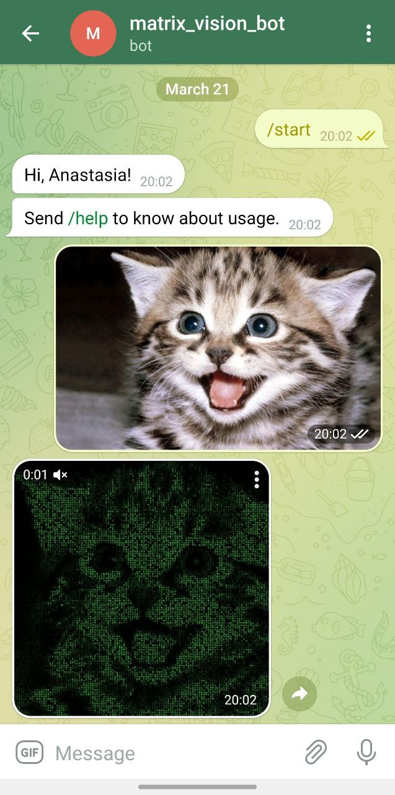

# Matrix Vision Bot


# What this bot can do? 

With this bot you can create awesome animations in matrix style. Bot accepts image or uncompressed image (document) from user, process it and reply with resulted animated image in matrix style.

# How it works

Bot runs in asynchronous way. Number of threads to use can be specified in `config.json` file:
```
{
  "token": "<token>",
  "fonts_path": "fonts/ms_mincho.ttf",
  "threads_num": 4
}
```
By default 4 threads is used.

Image sent by user is downloaded into memory into a file-like object using `io.BytesIO`. Then it is processed with `MatrixVision` class which returns animated file in `mp4` format. For chars rendering `pygame` is used. You also can specify which font to utilize in `config.json`. By default `ms_mincho.ttf` from `fonts` is used.

Creating of animation can be done either with `imageio` or `OpenCV`. Unfortunately, this libraries doesn't support writing right into memory using file-like object, so used workaround - store file on the disk and read it in memory aftewards, and only than send result to user.

# Setup

Bot dependecies are listed in [requirements.txt](requirements.txt) file. To install them execute next commands:

```
cd <matrix-vision-bot root dir>
python -m venv matrix-vision-bot-venv
./matrix-vision-bot-venv/Scripts/activate
(matrix-vision-bot-venv) python -m pip install -r requirements.txt
```

# Running
Set your telegram token in `config.json` and run python script in activated environment:
```
(matrix-vision-bot-venv) python matrix_vision_bot.py
```

# Usage Example



Here is the animated result:

